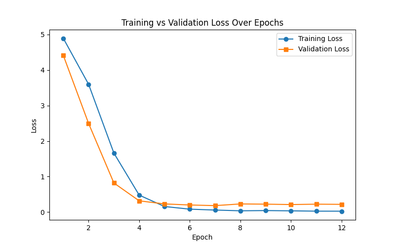

# NLP Intent Recognition Module Design and Evaluation Report

## 目录

- [一、业务需求分析](#一业务需求分析)
  - [1.1 业务背景与目标](#11-业务背景与目标)
  - [1.2 模型选择论证](#12-模型选择论证)
- [二、数据集](#二数据集)
  - [2.1 数据集描述](#21-数据集描述)
  - [2.2 预处理流程](#22-预处理流程)
  - [2.3 文本数据匿名化与隐私保护技术研究](#23-文本数据匿名化与隐私保护技术研究)
- [三、模型](#三模型)
  - [3.1 TensorFlow Extended (TFX) 与 MLOps 初步调研](#31-tensorflow-extended-tfx-与-mlops-初步调研)
    - [3.1.1 TFX 的核心价值](#311-tfx-的核心价值)
    - [3.1.2 TFX 的关键组件](#312-tfx-的关键组件)
    - [3.1.3 TFX 在 NLP 意图识别任务中的应用设想](#313-tfx-在-nlp-意图识别任务中的应用设想)
  - [3.2 模型架构](#32-模型架构)
  - [3.3 训练细节](#33-训练细节)
- [四、性能评估](#四性能评估)
  - [4.1 整体测试集性能评估](#41-整体测试集性能评估)
  - [4.2 针对不同长度文本性能评估](#42-针对不同长度文本性能评估)
  - [4.3 推理速度](#43-推理速度)
- [五、模型封装和部署](#五模型封装和部署)
  - [5.1 API设计文档初稿](#51-api设计文档初稿)
  - [5.2 大规模部署的潜在优化点分析](#52-大规模部署的潜在优化点分析)
  - [5.3 对模型偏见的初步检测和缓解策略思考](#53-对模型偏见的初步检测和缓解策略思考)

## 一、业务需求分析

### 1.1 业务背景与目标

在谷歌提供的产品服务中，用户的自然语言输入存在多样性与不确定性。为了提升系统自动理解能力，需要构建一个意图识别模块，能够准确识别用户请求的核心意图，从而驱动后续的自动处理逻辑。

该模块目标包括：
- 高准确率识别常见用户意图
- 具备可扩展性，支持未来业务的意图类别增加
- 推理速度快，能部署在生产环境中

### 1.2 模型选择论证

本项目采用 Hugging Face Transformers 库中的 **BERT（Bidirectional Encoder Representations from Transformers）** 作为基础模型，并使用其 TensorFlow 版本 (`TFBertForSequenceClassification`) 进行下游微调。

在初步调研中还评估了下列候选模型：

| 模型         | 优点                 | 局限                          |
|--------------|----------------------|-------------------------------|
| DistilBERT   | 推理速度快，模型小   | 表达能力略弱于 BERT          |
| ALBERT       | 参数共享，节省内存   | 收敛较慢，不适合小数据训练    |
| RoBERTa      | 更强预训练，表现稳定 | 模型较大，训练成本高          |
| TF-IDF + SVM | 实现简单，快速       | 泛化能力弱，适应性差          |

最终选择 **BERT-Base（TensorFlow 版）**，作为功能与工程权衡后的首选模型，并为未来模型蒸馏与加速部署预留优化空间。

---

## 二、数据集

### 2.1 数据集描述

本项目采用 CLINC150 数据集中的 "plus" 版本，作为意图识别任务的基准数据源。该数据集是面向真实用户场景构建的自然语言理解（NLU）资源，模拟了银行、电商、旅行等多个实际场景中用户的查询请求。

| 数据子集 | 样本数量 | 类别数 | 单个类别样本数量 |
|----------|----------|--------|------------------|
| 训练集   | 15,250    | 151    | 100（250）       |
| 验证集   | 3,100     | 151    | 20（100）        |
| 测试集   | 5,500     | 151    | 30（1000）       |

### 2.2 预处理流程

1. **载入数据**  
   使用 `datasets` 库加载 CLINC150 (plus) 数据集。由于 intent 为 42 的数据量相较其余 label 明显不平衡，因此删除 intent 为 42 的全部数据。最终数据集为 150 个标签。

2. **Tokenizer 编码**  
   使用 Hugging Face 的 `AutoTokenizer` 加载 `bert-base-uncased` 的预训练分词器，对输入文本进行：
   - WordPiece 编码
   - 最大长度截断：`max_length=32`
   - Padding 统一对齐

3. **转换为 TensorFlow Dataset**  
   使用 `to_tf_dataset()` 将 `DatasetDict` 转换为 `tf.data.Dataset`，便于后续微调模型训练。

### 2.3 文本数据匿名化与隐私保护技术研究

在由用户生成内容组成的数据集中，存在大量潜在的敏感信息，如姓名、地址、手机号、健康状况等。通过文本数据匿名化实现对用户隐私的保护是构建可信 AI 系统的关键步骤。

#### 2.3.1 文本匿名化（Text Anonymization / PII Removal）

文本匿名化是指检测并移除文本中的个人可识别信息（PII, Personally Identifiable Information），如人名、地点、电话号码、身份证号等。
常见方式包括：

- NER（命名实体识别）+ 替换：使用 NER 模型（如 spaCy、Stanza、BERT-NER）检测实体，然后用占位符替换：
- 正则表达式 + 黑名单：用规则识别邮箱、手机号、URL、信用卡号等结构化敏感信息。

该方法可在不影响语义结构的前提下，清除明确敏感内容。易于部署，可用于训练数据共享、模型微调等预处理环节。

#### 2.3.2 差分隐私（Differential Privacy in NLP）

差分隐私是一种添加噪声保护机制，使攻击者无法从模型输出中还原或推断单个训练样本是否存在。用于防止“模型记忆”某些敏感文本。
常见方式包括：

- 训练阶段加入噪声梯度（DP-SGD）：使用差分隐私随机梯度下降（Differentially Private SGD），在训练时对梯度裁剪 + 添加噪声。
- 私有语言建模（Private BERT/LMs）：使用 Google 的 Opacus 和 TensorFlow Privacy 工具包在 NLP 模型中实现差分隐私训练。

该方法使得即使模型被公开或查询，仍难以恢复原始用户数据，可防止训练数据泄漏。适用于聊天记录、电子病历、搜索日志等高度敏感文本建模。

---

## 三、模型

### 3.1 TensorFlow Extended (TFX) 与 MLOps 初步调研

TensorFlow Extended (TFX) 是 Google 开源的 端到端机器学习平台，旨在将 ML 模型从开发阶段推向生产部署，并实现持续训练、自动验证与监控。它是 Google 内部使用的 MLOps 工具链的外部版本，支持高度自动化、可扩展、可重复的模型生命周期管理。

#### 3.1.1 TFX 的核心价值

- TensorFlow Extended（TFX）在机器学习系统化构建中具备高度的自动化与可重复性，能够将 ML 工作流程拆解为标准化的可组合组件，实现从训练到验证再到部署的完整流水线。
- 它内置模型质量保障机制，例如自动的数据验证和模型性能对比，能有效防止模型因数据漂移而性能下降。
- TFX 原生支持大规模生产环境的部署，能够无缝集成至 Google Cloud（如 Vertex AI Pipelines）或 KubeFlow 等工业级平台。
- TFX 也持持续训练与更新，包括定期调度重训练、模型版本控制及 A/B 测试等运维功能。
- 其框架允许集成脱敏处理、审核流程等安全与合规机制，帮助满足企业级 AI 应用在数据隐私与发布安全方面的严格需求。

#### 3.1.2 TFX 的关键组件

| 组件名           | 作用与说明                                  |
|------------------|---------------------------------------------|
| ExampleGen       | 读取原始数据源（CSV/TFRecord/BigQuery）     |
| StatisticsGen    | 自动生成数据统计特征                        |
| SchemaGen        | 推断数据 schema（类型/范围/缺失值）         |
| ExampleValidator | 检测数据异常                                |
| Transform        | 做特征工程（如标准化、嵌入编码）            |
| Trainer          | 定义并训练 TensorFlow 模型                  |
| Evaluator        | 模型指标评估                                |
| Pusher           | 部署模型到生产环境                          |

#### 3.1.3 TFX 在 NLP 意图识别任务中的应用设想

在本次基于 BERT 实现的意图识别服务中，TFX 能在训练和评估阶段提供重要支持。

- **数据处理：**
  - 可以使用 `ExampleGen` 组件读取 CLINC150 数据集中的意图分类样本；使用 `StatisticsGen` 和 `ExampleValidator` 检查数据分布与标签偏移问题，以保证训练样本的质量；使用`Transform` 实现文本归一化、分词等预处理步骤
- **模型训练：**
  - 可以使用 `Trainer` 微调 `TFBertForSequenceClassification` 模型。
- **模型评估：**
  - 可以使用 `Evaluator` 设置准确率和 F1-score 等指标，与历史模型进行比较，从而判断新模型性能。
- **模型部署：**
  - `Pusher` 可将模型部署至 TensorFlow Serving 或 Vertex AI Prediction，提供推理服务。配合持续集成机制，还可以将每日收集到的用户数据用于模型再训练，并在通过自动评估后更新版本。

不过，由于 TFX 在 Windows 系统上功能受限（完整支持需 Linux 环境），因此当前项目主要采用 TensorFlow + HuggingFace + FastAPI 实现，TFX 的集成将在未来部署阶段逐步考虑。

### 3.2 模型架构

本系统采用 Hugging Face 提供的 `TFBertForSequenceClassification`，基于 `bert-base-uncased` 模型，在其顶部添加线性分类层（softmax）：

- **Encoder：** 12层 Transformer 编码器（110M 参数量）
- **Pooling：** 使用 `[CLS]` token 输出
- **Classifier：** 全连接层输出 `num_labels` 维度的 logits

输出层为未归一化的 logits，用于 `SparseCategoricalCrossentropy(from_logits=True)` 损失函数计算。

### 3.3 训练细节

| 项目             | 参数                       |
|------------------|----------------------------|
| 微调框架         | Hugging Face Transformers + TensorFlow |
| 预训练模型       | `bert-base-uncased`        |
| 学习率           | 5e-5                       |
| 批大小           | 32                         |
| 最大长度         | 32                         |
| 训练周期         | 最多 100，早停策略         |
| Early Stopping 策略 | 验证集 5 轮未提升停止    |
| 优化器           | AdamW + warmup             |
| Warmup 步数      | 总步数的 10%               |

---

## 四、性能评估

   
  <b>Figure 1:</b> Training and Valdition Loss

epoch 5 之后出现了明显的过拟合现象，验证损失停止改善，而训练损失继续减少。

### 4.1 整体测试集性能评估

| metric   | micro / overall | macro avg | weighted avg |
|----------|------------------|-----------|--------------|
| Accuracy | 0.959 (95.9%)     | —         | —            |
| Precision | —               | 0.961     | 0.961        |
| Recall    | —               | 0.959     | 0.959        |
| F1-score  | —               | 0.959     | 0.959        |

从整体测试集单类测试结果可以看出，150 类全部达到高一致性。只有极少数类别（如 id = 68、89、150）出现 F1≈0.87~0.89，处于可接受区间内。模型微调结果基本上满足了工业中大部分意图识别需要，对于少数类别后续可通过 focal-loss 或重采样进一步提升效果。

### 4.2 针对不同长度文本性能评估

| Bucket         | 样本数 | Accuracy | Macro F1 |
|----------------|--------|----------|----------|
| Short (≤5词)   | 881    | 97.0%    | 0.943    |
| Medium (6-12词)| 3,190  | 95.7%    | 0.956    |
| Long (>12词)   | 429    | 95.3%    | 0.890    |

结果可以看出，模型对短句最为稳定，准确率达到了97%。长句略有下降，但准确率仍 > 95 %。后续可考虑将 max_length 提升至 64，并用 text‐span truncation + sliding window 技巧处理极长输入。也可以更换复杂模型减少模型本身对长句的敏感度。

### 4.3 推理速度

- 输入文本："how do I cancel my order"
- 重复次数：100 次
- **平均推理时间：≈ 102.07 ms/sample**

---

## 五、模型封装和部署

### 5.1 API设计文档初稿

| 项目         | 说明                                     |
|--------------|------------------------------------------|
| 服务基址     | `https://<your-domain>/v1`               |
| 资源名       | `intents`                                |
| 主要端点     | `POST /v1/intents:predict`               |
| 协议         | HTTPS + JSON (UTF-8)                     |
| 错误模型     | `google.rpc.Status`                      |
| 实现         | 详见 `app.py` 和 OpenAPI `.yaml` 文件   |

### 5.2 大规模部署的潜在优化点分析

在原型阶段，测得平均推理延迟约 102 ms／样本，这对于低 QPS 场景已经可接受。但一旦面向谷歌级别的在线服务，吞吐、成本与弹性就成为核心考量。因此，进一步优化包括：

- **模型结构优化：**
  - 使用 DistilBERT、TinyBERT 蒸馏模型替代 BERT-base
- **推理引擎优化：**
  - 将 TensorFlow 模型导出为 ONNX 格式
  - 使用 ONNX Runtime 或 TensorRT 加速执行
- **部署层优化：**
  - 启用 XLA 编译或 TF-TRT 混合精度（FP16/INT8）
  - 利用动态批处理、异步推理、自动弹性伸缩提高吞吐

### 5.3 对模型偏见的初步检测和缓解策略思考

此数据集CLINC150 本身经过均衡采样，在预处理后做到了所有类别均匀分布，因此在话题维度方面模型对表面特征尚无明显偏差。但在真实应用中，用户输入会呈现地域、性别等多维分布。因此可通过替换敏感词，根据Embedding Association Test (EAT) 或 SEAT 基准观察模型是否对特定群体或词汇产生系统性偏差。

针对于模型部分：

- **数据增强：**
  - 可通过回译、同义替换与过采样为弱势子群体扩充样本。
- **训练调控：**
  - 可采用重加权或对抗式去偏技术，让模型在保持整体性能的同时降低对敏感特征的依赖。
- **推理控制：**
  - 可以用阈值校准或置信度惩罚的方式，对误报率较高的子群体进行“软保护”。
- **偏差监控：**
  - 在 MLOps 中加入在线偏差检测与指标告警触发机制，从而控制潜在的偏差风险。

